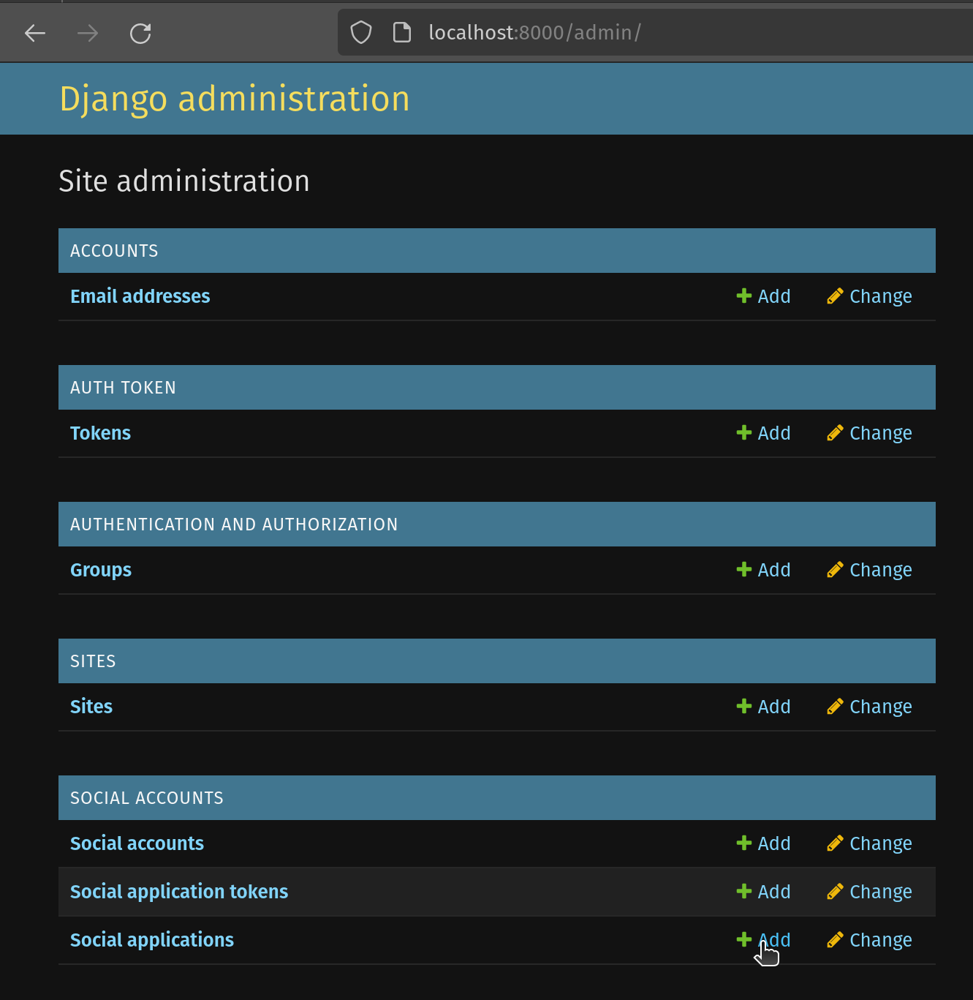

# Backend

## Prerequisites

### Docker installation
Follow the official installation instructions for Docker as mentioned [here](https://docs.docker.com/desktop/install/linux-install/).

### Set up Postgres
In order to set up Postgres using Docker on your local machine for your database, use the following command.

```sh
docker run --name postgres -p 5432:5432 -e POSTGRES_USER=docker -e POSTGRES_PASSWORD=docker -e POSTGRES_DB=docker -d postgres
```

Note that this creates a user with the username and password `docker` for a database named `docker`. These parameters may be changed. However, ensure that you reflect these changes in the `.env` files to follow.

### Download Pipenv

#### Without external distributions
In order to install and run Pipenv without the use of an external distribution such as Anaconda, run the following commands.

```sh
python3 -m pip install pipenv
```

This assumes pip is available on the given system. If running pip is not allowed globally, attempt to run pip from within a Python virtual environment, venv. Now, run the following from the `../api/app` file path.

```sh
python3 -m pipenv shell
```

#### With Anaconda
`WIP`

## Further configuration
Now, from this Pipenv shell, do the following.

### Edit the Environment variables
First, copy `./api/app/env.example` to `./api/app/.env`. You can do this by running the following command.

```sh
mv env.example .env
```

Now, add the configuration information of the Postgres database that was set up previously, to this `.env` file. Edit the `.env` file using your preferred text editor, and ensure it looks like the following. Ensure to use the credentials used in section I.2.

```
DJANGO_SECRET_KEY=test
JWT_SECRET_KEY=ADD_SECRETKEY_HERE
MEETSY_POSTGRES_DB=docker
MEETSY_POSTGRES_USER=docker
MEETSY_POSTGRES_PASSWORD=docker
MEETSY_POSTGRES_HOST=localhost
```

> **Note:** Replace the `JWT_SECRET_KEY` with one generated by you. You can get this string by running the following command:

```sh
openssl rand -base64 32
```

### Localhosted development
Locally hosting this application requires adding the following to `./app/core/settings.py`.

```
239. DEBUG = True

241. ALLOWED_HOSTS = [".meetsy.xyz", "localhost"]
```

### Running the backend
Run the following commands in order to get the backend up and running at `localhost:8000`.

```sh
python manage.py migrate
python manage.py runserver
python manage.py createsuperuser
```

After this, you will receive a prompt where you must create your Admin user and password. Once you're done adding them, visit `localhost:8000/admin` and log in with the same credentials.

### Adding Google APIs

#### Add social application
Add a Social Application from your Django administration menu.



#### Add Google API details

- **Provider:** Google
- **Name:** Google Calendar API
- **Client ID:** `ADD_CLIENTID_HERE`
- **Secret Key:** `ADD_SECRETKEY_HERE`


5. Move the `example.com` site from Available sites to Chosen sites. (Fig. 2)
6. Click Save
